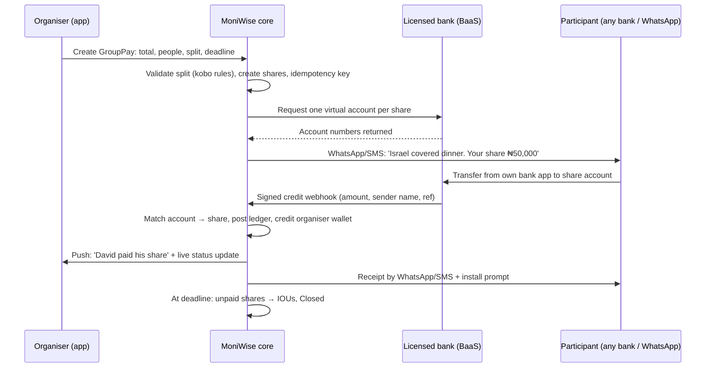
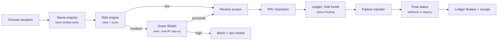
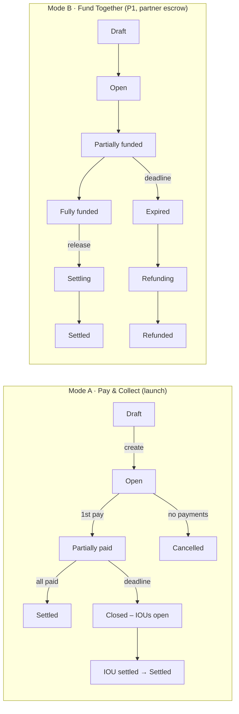

# MoniWise: Solution Architecture Review & Redesign

**Sort money out together.** Critical evaluation, 10 launch features, redesigned BRD, FRD, flow architecture, UI designs and build plan.

| | |
|---|---|
| Version | 2.0 (supersedes BRD v1.0) |
| Date | October 2026 |
| Markets | Nigeria first, Ghana second |
| Status | Ready for build planning |

> Not legal advice. Validate regulatory items with Nigerian payments counsel and partners.

---

*START HERE*

# The one-page answer

MoniWise is a **strong idea with a commodity core**. Its real product is not Send and Receive (every Nigerian bank and wallet already does that well); it is the **coordination layer**: who owes what, who has paid, and why the money moved. This review keeps that insight, removes the parts of v1.0 that would slow launch or invite regulatory trouble, and turns the BRD into something an engineering team can build from.

| Question | Short answer |
|---|---|
| Should this be built? | **Yes**, if launch is narrowed to GroupPay Pay & Collect + IOUs and non-users can pay without installing the app. |
| Biggest winning edge | Every GroupPay is a free invite to 3-10 people who already owe money to an existing user. Acquisition is built into the job. |
| Biggest flaw in v1.0 | It assumes payers will use MoniWise. Most will pay by plain bank transfer, and v1.0 has no way to see or match those payments. |
| Single most important fix | A **dedicated virtual account number per GroupPay share**, so payments from any bank auto-match and auto-confirm. |
| What to delay | Fund Together (pooled money), Pots, merchant tools and Ghana until custody and partner permissions are signed. |
| Realistic launch | Closed beta month 6, public Nigeria launch month 7 with a 9-10 person core team. |

## How this document is organised

| Part | What it covers | Read it if you are... |
|---|---|---|
| A. Evaluation | Scorecard, winning edge, downsides and how to fix each one | Founder, investor, PM |
| B. 10 launch features | What to add at launch, why it wins, how to build it, which ship Day 1 | Founder, PM, design |
| C. Redesigned BRD | Tighter scope, business rules, KYC tiers, revenue, metrics, roadmap | Everyone |
| D. FRD | Module-by-module requirements with IDs and acceptance criteria | Engineering, QA |
| E. Flow architecture | System design, sequence flows, state machines, ledger postings, data model, APIs | CTO, engineers |
| F. UI designs | Nine annotated mobile screens plus the design system and UX copy rules | Design, mobile engineers |
| G. Build plan | Team, sprint plan, launch checklist and open decisions | Founder, PM, CTO |

---

*PART A*

# Critical evaluation

## A1. Scorecard

> Scored 1-5 against what it takes to win in Nigerian consumer payments in 2026.

| Dimension | Score | Assessment |
|---|---|---|
| Problem clarity | ●●●●● | Real, frequent and emotionally loaded ("who never pay?"). Clearly written. |
| Differentiation | ●●●○○ | GroupPay and IOU are distinctive today, but are features any big wallet can copy in a quarter. |
| Distribution / growth loop | ●●●●○ | Excellent in theory. Breaks if invitees must install an app before paying. |
| Regulatory realism | ●●●●○ | Partner-first is correct. Fund Together and Pots need sharper custody design. |
| Scope discipline | ●●○○○ | ~25 P0 items for an 8-month build. Too wide for the team listed. |
| Business model | ●●○○○ | Free social payments plus per-transfer rail costs means negative unit economics until merchants or subscriptions kick in. |
| Technical foundations | ●●●●○ | Double-entry ledger, idempotency, reconciliation and provider abstraction are exactly right. |
| Implementation readiness | ●●○○○ | No data model, APIs, acceptance criteria, rounding rules, numeric SLAs or edge cases. Fixed in Parts D-E. |

## A2. The winning edge

**Acquisition is built into the job.** An organiser creating one GroupPay reaches 3-10 people who each have a reason to open the link today. That is a far cheaper acquisition channel than referral bonuses, which is how most Nigerian wallets grew.

**It owns a moment, not a rail.** Banks own the transfer; nobody owns "the bill just came". Owning that moment is what makes the product sticky, and it matches how people actually socialise (owambe, office lunches, trips, house bills).

**Context is a data moat.** Every payment carries a human reason ("David’s share of dinner"). Over time this produces the richest picture of social financial behaviour in the market, which later powers risk scoring, Money Book and partner products.

**Partner-first keeps capital needs low.** No licence needed on day one if every regulated activity sits with a licensed partner. The team spends on product and trust, not on capital requirements.

**Interoperable by default.** Nigeria’s instant interbank rail means a payer can use any bank app. MoniWise does not need to win the payer’s wallet, only the organiser’s.

**Strong engineering instincts.** Ledger-first, idempotent, reconciled design is what separates fintechs that survive their first fraud wave from those that do not.

## A3. Downsides, risks and the fix for each

| # | Problem in v1.0 | Why it matters | Fix in v2.0 |
|---|---|---|---|
| 1 | Payers are assumed to pay inside MoniWise. | Most invitees will pay with their own bank app. MoniWise never sees the payment, so status, receipts and the growth loop all break. | **Virtual account per share** (Feature 1). Any bank transfer auto-matches. App install becomes optional. |
| 2 | Send/Receive is presented as core. | Opening another wallet for transfers is not a reason to switch. Incumbents (OPay, PalmPay, Moniepoint, Kuda, banks) do it well and free. | Lead with GroupPay and IOU on the home screen. Send/Receive is plumbing, not the pitch. |
| 3 | Fund Together pools other people’s money. | Holding third-party funds for a group is the most regulated thing in the BRD and the most fraud-prone. | Move to P1 behind a partner escrow sub-account with refund-to-source. Launch with Pay & Collect only. |
| 4 | Scope too wide for P0. | 25 launch items across 8 months risks a late, shallow launch. | Re-cut P0 around the GroupPay loop (Part C3); move pooled money, Pots and merchant tools out. Later items earn their way in with data. |
| 5 | Unit economics are negative. | Each interbank transfer carries a rail cost; "free social payments" multiplies it. | Free in-app transfers, capped free external transfers, Plus subscription, VAS commissions, event and merchant fees (Part C6). |
| 6 | GroupPay is a scam vector. | Fake "contribution" groups, fake owambe links and impersonated organisers are predictable attacks. | Verified-name display, new-organiser caps, link expiry, Scam Shield (Feature 10), report button on every link. |
| 7 | Lives outside WhatsApp. | Social feed and chat are excluded (correct), but Nigerian groups coordinate on WhatsApp; v1.0 has no plan there. | WhatsApp share cards and a WhatsApp bot for reminders and status (Feature 2). |
| 8 | No rules for awkward edges. | Uneven splits (₦100,000 / 3), partial payments, overpayment, someone leaving the group, deadline passing. | Explicit business rules in Part C4: kobo rounding, overpayment handling, auto-conversion of unpaid shares to IOUs. |
| 9 | Name risk. | The "Moni-" prefix is crowded in Nigerian fintech, and app-store search will be noisy. | Run trademark and app-store clearance in month 0; hold 2 backup names. |
| 10 | Ghana treated as a second Nigeria. | Ghana is mobile-money first; the rails, KYC and partner model differ. | Ghana is a separate integration track after Nigeria proves retention. |
| 11 | Not implementable as written. | No data model, APIs, state transitions, acceptance criteria or numeric SLAs. | Parts D and E supply them. |

> **Architect’s verdict**  
> Treat MoniWise as a **coordination product that happens to move money**, not a wallet with a split feature. Every design choice below follows from that: payers never need the app, the organiser always knows status, and unfinished obligations never disappear.

---

*PART B*

# 10 fintech features to add at launch

Each feature is chosen because it strengthens the GroupPay loop, builds trust, or creates a reason to return. Six can ship on Day 1. Four depend on a partner permission (e-mandate, escrow, collective savings) and are scheduled for the **launch window** (within 90 days of public launch) so they do not hold the launch hostage.

| # | Feature | What it does | Why it wins | Ships |
|---|---|---|---|---|
| 1 | **Pay-from-Any-Bank** (virtual account per share) | Each participant gets a unique account number for their share. Transfer from any bank app; MoniWise matches it instantly. | Removes the #1 adoption barrier. Payers need no app; organisers get real-time status. | **Day 1** |
| 2 | **WhatsApp GroupPay** | Rich share card in WhatsApp; bot replies to "status", "remind" and "pay" with a link. Payment opens a light web checkout. | Meets groups where they already talk. Every message is branded distribution. | **Day 1** |
| 3 | **Bill Snap** | Photo of the restaurant bill → OCR reads total, items and service charge → assign items with a tap. | Kills the calculator. Turns item split (v1.0 Phase 2) into a 20-second task. | **Day 1** (total + VAT/service), items in v1.1 |
| 4 | **Smart Nudges** | Organiser picks a tone (Gentle, Naija-funny, Formal). MoniWise sends the reminder so the organiser is not "the one chasing". Max 1/day per person. | Removes the awkwardness, which is the emotional core of the problem. | **Day 1** |
| 5 | **Owambe Spray** | Event QR and link for weddings, birthdays and burials. Guests "spray" digital notes; celebrant sees a live wall and total. | Culturally native, high-value, extremely viral. Built on the existing Receive module. | **Day 1** |
| 6 | **Scam Shield** | Bank-verified name before every payment; warnings for first-time payee, unusual amount, new device; optional 30-min cool-off and trusted-contact alert. | Trust is the brand. Authorised-push-payment fraud is the biggest consumer fear. | **Day 1** |
| 7 | **Bills Together** | Split recurring household bills (electricity, internet, TV, rent share) and pay the biller directly once everyone has paid in. | Creates monthly habit, not just weekend use. Earns biller commission. | Launch window |
| 8 | **Payday Auto-Settle** | Debtor approves a direct-debit mandate: "Pay my IOU on the 28th". Automatic, polite, optional. | Raises IOU settlement rate; nobody has to ask twice. | Launch window (e-mandate partner) |
| 9 | **SafeHold** (social-commerce escrow) | Buyer pays into a partner-held escrow; funds release when buyer taps "Received" or after a timer. | Fixes the "what I ordered vs what I got" trust gap with Instagram/WhatsApp vendors. Paid feature. | Launch window (escrow partner) |
| 10 | **Ajo Circles** | Digital rotating savings: fixed members, amount, order and payout dates; contributions held by a licensed partner; auto-debit option. | Digitises a trusted habit millions already practise; strong retention. | Launch window (custody approval) |

## How each feature is built

| # | Build approach | Partner / dependency | Effort |
|---|---|---|---|
| 1 | Request a dynamic account per obligation from the BaaS partner; map account → obligation; inbound credit webhook triggers ledger posting. Wrong amount: accept partial, refund excess. | Licensed bank / BaaS with dynamic virtual accounts | M |
| 2 | WhatsApp Business Platform via a BSP. Template messages for invites and reminders; session replies for bot commands. Web checkout is a server-rendered page under 150 KB. | WhatsApp BSP | M |
| 3 | On-device text recognition for speed and privacy, server fallback. Parse total, VAT and service lines; user always confirms. | ML Kit / cloud OCR | S-M |
| 4 | Reminder templates + scheduler; frequency caps; stop when paid; quiet hours 21:00-08:00. | Notifications module | S |
| 5 | An "event" receive type with its own account number and QR, a live wall (WebSocket) and a settlement to the celebrant. | Same as Feature 1 | S-M |
| 6 | Name enquiry on every external send; rules engine (first payee, amount vs 90-day median, new device < 24h); interstitial UI. | Rail name-enquiry via partner; risk engine | M |
| 7 | GroupPay with recurring schedule + biller payment via VAS aggregator once fully funded (needs escrow-style holding). | VAS aggregator; custody partner | M |
| 8 | Create and store mandate reference; schedule debit; handle failure with retry once then IOU stays open. | Direct-debit / e-mandate partner | M |
| 9 | Escrow sub-account per order at partner; state machine Held → Released / Disputed / Refunded. | Escrow-capable licensed partner; counsel sign-off | L |
| 10 | Circle entity + schedule; contributions into partner-held account; payout to member in rotation order. | Custody partner; counsel sign-off | L |

---

*PART C*

# Redesigned Business Requirements (BRD v2.0)

## C1. Product definition

> **One-sentence definition**  
> MoniWise helps people **sort money out together**: split a bill, collect what you are owed, keep track of who owes whom, and see where your money went. Payers can use any bank app. The organiser always knows who has paid.

| Element | v1.0 | v2.0 (recommended) |
|---|---|---|
| Hero action | Four equal actions (Send, Receive, GroupPay, Pots) | GroupPay first; Send/Receive as supporting actions; Pots after launch |
| Who must install the app | Implied: all participants | Only the organiser. Payers use any bank app, web checkout or WhatsApp |
| Launch GroupPay modes | Pay & Collect + Fund Together, equal + custom | Pay & Collect with Equal, Custom and Percentage. Fund Together in P1 |
| Unpaid shares at deadline | GroupPay marked Expired | Unpaid shares automatically become IOUs (nothing is lost) |
| Positioning line | Your everyday money app | "Sort money out together." Pay. Split. Collect. Keep track. |

## C2. Target users and jobs-to-be-done

| Persona | Job to be done | Launch feature set |
|---|---|---|
| The Organiser (beachhead) | "I paid; get my money back without chasing anyone." | GroupPay Pay & Collect, Smart Nudges, WhatsApp, IOU |
| The Payer (invitee) | "Tell me what I owe and let me pay from my own bank." | Pay-from-Any-Bank, web checkout, receipt |
| Flatmates / couples | "Split house bills fairly every month." | Custom/% split, Bills Together, Money Book |
| Celebrant / host | "Collect gifts and contributions at my event." | Owambe Spray |
| Young professional | "Know who owes me and where my salary went." | IOU, Money Book, Scam Shield |
| Micro-merchant (later) | "Get paid and confirm instantly." | Receive QR, then Merchant tools (P2) |

## C3. Scope: what launches and what waits

| Tier | Capabilities | Gate to enter |
|---|---|---|
| **P0 Launch** | Sign-up and auth; tiered KYC; username; wallet via partner; Send (in-app + any bank) with Scam Shield; Receive (username, link, QR, account no.); GroupPay Pay & Collect (equal, custom, %); Pay-from-Any-Bank; web checkout; WhatsApp share + bot; Smart Nudges; IOU; Money Book basic; receipts and notifications; ledger + reconciliation; risk rules; admin and support console; Owambe Spray; Bill Snap (totals) | Partner contract signed; counsel opinion on wallet and collections |
| **Launch window** (+90 days) | Bills Together; Payday Auto-Settle; SafeHold escrow; Ajo Circles; Bill Snap items | Each needs its partner permission confirmed in writing |
| **P1 Retention** | Fund Together; personal Pots; saved groups; recurring GroupPay; favourites; enhanced Money Book | 30-day organiser repeat rate ≥ 35% |
| **P2 Business** | Merchant profiles and dashboard; payment pages; invoices; API and webhooks; exports | ≥ 20% of volume from merchant-like accounts |
| **P3 Partner finance** | Savings with interest, insurance, credit, cards (all partner-led) | Licensed partner + clean risk history |
| **P4 Cross-border** | Ghana (mobile-money rails), then NG-GH corridor | Nigeria unit economics positive |

> Still excluded from launch: loans/BNPL, crypto, investments, physical cards, payroll, POS hardware, FX accounts, international remittance, social feed.

## C4. Business rules (the edges v1.0 left open)

| ID | Rule |
|---|---|
| BR-01 | All money is stored and calculated in **kobo as integers**. No floating point anywhere. |
| BR-02 | Equal split remainder: each share = floor(total / n). The remaining kobo are added to the **organiser’s** share. Example: ₦100,000 / 3 = ₦33,333.33 × 2 and organiser ₦33,333.34. |
| BR-03 | Custom and % splits must equal the total exactly before the GroupPay can be created. % shares are converted to kobo with the same remainder rule. |
| BR-04 | Pay & Collect: participant payments go **directly to the organiser’s wallet**. MoniWise never pools the money. This keeps launch out of collective-custody rules. |
| BR-05 | Partial payments are accepted and reduce the share. Overpayments: the excess is refunded to source automatically within 24h. |
| BR-06 | At the deadline (default 7 days, max 60), every unpaid or partly-paid share becomes an IOU between payer and organiser, linked to the GroupPay. |
| BR-07 | An organiser can remove a participant only while they have paid nothing; their share is redistributed or absorbed, with a recalculation the organiser confirms. |
| BR-08 | Reminders: max 1 per participant per day, 5 per share in total, none between 21:00 and 08:00 local time, stop automatically once paid. |
| BR-09 | A virtual account issued for a share expires when the share is paid, cancelled or 72h after the deadline. Late transfers are refunded to source. |
| BR-10 | New organisers (account < 30 days or Tier 1) are capped on GroupPay total and number of open GroupPays (values set by risk team). |
| BR-11 | IOUs are records of private agreements, never MoniWise credit. MoniWise does not charge interest, penalties or late fees on IOUs. |
| BR-12 | Refunds always go back to the original source account. Never to a different account. |
| BR-13 | Privacy: default mode shows participants and paid/unpaid status to the group, but amounts only to the organiser and the individual payer. |

## C5. Identity and KYC tiers (Nigeria)

> Tier structure follows the CBN three-tier KYC framework as applied by the chosen partner bank. Limits below are **placeholders** and must be replaced with the partner’s current approved figures before build.

| Tier | User provides | Verification | Unlocks |
|---|---|---|---|
| Guest (no account) | Nothing beyond paying from own bank | Payer’s bank already did KYC; we store the sender name from the transfer | Pay a GroupPay share, spray at an event |
| Tier 1 | Phone (OTP), name, date of birth, selfie, BVN or NIN | Identity check via KYC provider; liveness | Wallet, send/receive within low limits, create GroupPays (capped) |
| Tier 2 | BVN and NIN both verified | Name/photo match across BVN and NIN | Higher limits, uncapped GroupPay count, Spray events |
| Tier 3 | Address proof + ID document | Address verification; manual review if flagged | Highest limits, SafeHold seller, Ajo organiser |

## C6. Revenue model (unit economics fix)

> Principle from v1.0 is kept: **the social loop stays free**. Revenue comes from convenience, scale and businesses. Figures are indicative starting points for pricing tests.

| Stream | How it works | Indicative price | When |
|---|---|---|---|
| In-app transfers | MoniWise to MoniWise | Free (internal ledger move, no rail cost) | Launch |
| External transfers | To any bank account | First 10/month free, then small flat fee | Launch |
| Pay-in to GroupPay | Payer transfers to share account | Free to payer and organiser | Launch |
| MoniWise Plus | Unlimited free transfers, unlimited open GroupPays, exports, custom nudges | ₦1,000-1,500 / month | Launch + 60 days |
| Owambe Spray | Fee on event total, paid by celebrant | 1-1.5%, capped | Launch |
| Bills and airtime (VAS) | Commission from aggregator | Aggregator margin | Launch window |
| SafeHold | Fee per protected order, paid by seller | 1%, capped | Launch window |
| Merchant QR and pages | Fee per collection | Below card rates; capped | P2 |
| Partner referrals | Licensed savings/insurance/credit referrals | Revenue share | P3 |

## C7. Success metrics with targets

**North Star:** Coordinated Money Events per Monthly Active User (kept from v1.0). Targets are for the first 90 days after public launch.

| Metric | Definition | 90-day target |
|---|---|---|
| Invite-to-pay conversion | Shares paid / shares created | ≥ 70% |
| Time to settle | Median time from GroupPay creation to Settled | < 24 hours |
| Organiser repeat rate | Organisers who create another GroupPay within 30 days | ≥ 35% |
| Payer → user conversion | Guest payers who register within 30 days | ≥ 15% |
| Viral coefficient | New registered users generated per new organiser | ≥ 0.6 |
| IOU settlement rate | IOU value settled within 30 days of due date | ≥ 60% |
| Payment success | Successful / attempted outbound payments | ≥ 98.5% |
| Auto-match rate | Inbound transfers matched without manual action | ≥ 99.5% |
| Fraud loss | Confirmed fraud loss / total volume | < 5 basis points |
| Support load | Tickets per 1,000 transactions | < 4 |

## C8. Revised 12-month roadmap

| Months | Focus | Exit criteria |
|---|---|---|
| 0-1 | Name clearance; company and partner shortlist; counsel opinion; UX research with 30 organisers; architecture and ledger design | Partner term sheet; validated prototype |
| 2-3 | Auth, KYC, wallet, ledger, Send/Receive, Scam Shield, admin skeleton | Internal money moves end to end in sandbox |
| 4-5 | GroupPay, Pay-from-Any-Bank, web checkout, WhatsApp, Nudges, IOU, Money Book, Spray, Bill Snap | Feature complete; security test passed |
| 6 | Closed beta: 50 friend groups, 5 events, staff and families | Invite-to-pay ≥ 60%, zero ledger breaks |
| 7 | **Nigeria public launch** | Go-live checklist (Part G3) green |
| 8-10 | Launch window features; Fund Together; Pots; Plus subscription | Organiser repeat ≥ 35% |
| 11-12 | Merchant beta; API foundation; Ghana partner and rails discovery | Board go/no-go on Ghana |

---

*PART D*

# Functional Requirements (FRD)

Each requirement has an ID, a priority and acceptance criteria written as Given / When / Then so QA can test it directly. P0 = launch, LW = launch window.

## D1. Identity, access and KYC (AUTH, KYC)

| ID | Requirement | Acceptance criteria | Pri |
|---|---|---|---|
| AUTH-01 | Register with phone number + OTP | Given a new number, when OTP is entered within 5 min, then account is created; 5 wrong OTPs lock for 30 min. | P0 |
| AUTH-02 | Set 6-digit PIN and optional biometrics | PIN cannot be sequential or repeated digits; biometrics only unlock, PIN still required to change PIN. | P0 |
| AUTH-03 | Device binding | Login on a new device needs OTP + PIN; outbound transfers above a set amount blocked for 24h on new devices. | P0 |
| AUTH-04 | Session control | Idle timeout 5 min; user can see and revoke active devices. | P0 |
| KYC-01 | Tier 1 onboarding | BVN or NIN + selfie liveness passes → Tier 1 within 60 s in 90% of cases; failures route to manual review queue. | P0 |
| KYC-02 | Tier upgrade | User can upgrade in app; limits update immediately after approval. | P0 |
| KYC-03 | Unique username | 3-20 chars, letters/digits/underscore, unique, changeable once per 90 days; old username reserved 90 days. | P0 |

## D2. Wallet, Send and Receive (PAY)

| ID | Requirement | Acceptance criteria | Pri |
|---|---|---|---|
| PAY-01 | Wallet with dedicated account number | On Tier 1 approval a permanent account number is issued by the partner and shown on Home. | P0 |
| PAY-02 | Send to username / phone / bank account | External sends show bank-verified name before confirm; user must confirm with PIN or biometrics. | P0 |
| PAY-03 | Purpose and category on every send | Purpose optional, category auto-suggested; both stored on transaction and visible in Money Book. | P0 |
| PAY-04 | Idempotent payments | Same idempotency key within 24h returns the original result; double-tap never creates two debits. | P0 |
| PAY-05 | Unknown status handling | If partner times out, status = Pending, user sees "We’re confirming"; requery job resolves within 15 min or raises ops exception. | P0 |
| PAY-06 | Receive by link and QR | Fixed or open amount; link works in any browser; QR encodes the link. | P0 |
| PAY-07 | Payment request | Request to a user or phone; payer can pay, decline or ignore; requester sees status. | P0 |
| SHD-01 | Scam Shield checks | Given first-time payee OR amount > 3× 90-day median OR device < 24h, when user reviews, then warning screen shows with reasons and a "Cancel" primary option. | P0 |
| SHD-02 | Cool-off option | User can enable a 30-minute delay on sends above their chosen amount; cancel available until release. | P0 |

## D3. GroupPay (GP)

| ID | Requirement | Acceptance criteria | Pri |
|---|---|---|---|
| GP-01 | Create GroupPay | Requires title, total, ≥2 participants, split method, deadline; Pay & Collect requires organiser to confirm they paid. | P0 |
| GP-02 | Split calculation | Equal / Custom / % follow BR-02 and BR-03; Create is disabled until shares sum to total; UI shows remaining difference live. | P0 |
| GP-03 | Add participants | From contacts, username, phone or "anyone with link" slots; non-users allowed. | P0 |
| GP-04 | Share account per participant | Each share gets a unique virtual account number valid per BR-09. | P0 |
| GP-05 | Auto-match inbound payment | Given a credit webhook on a share account, when amount ≤ outstanding, then share reduces, ledger posts, organiser is notified in < 5 s from webhook. | P0 |
| GP-06 | Overpayment | Amount above outstanding: share marked Paid, excess refunded to source within 24h, both parties notified. | P0 |
| GP-07 | Live status | Organiser and participants see status per privacy mode (BR-13); updates in real time while screen open. | P0 |
| GP-08 | Smart Nudges | Organiser selects tone; system sends via WhatsApp/SMS/push respecting BR-08. | P0 |
| GP-09 | Deadline conversion | At deadline, unpaid shares become IOUs linked to the GroupPay; status becomes "Closed – IOUs open". | P0 |
| GP-10 | Cancel | Allowed only when no payments received; otherwise organiser can close early (converts to IOUs). | P0 |
| GP-11 | Receipt | Settled GroupPay produces a shareable receipt (image + PDF) with reference, items, payers and timestamps. | P0 |
| GP-12 | Bill Snap | Photo detects total and service charge with user confirmation; confidence < 80% asks user to edit. | P0 |
| GP-13 | Fund Together | Contributions held in partner escrow; organiser releases to merchant when funded; refund-to-source if expired. | P1 |

## D4. WhatsApp and guest web checkout (WA, WEB)

| ID | Requirement | Acceptance criteria | Pri |
|---|---|---|---|
| WA-01 | Share card | Share produces a WhatsApp message with title, organiser, each person’s amount (per privacy) and link. | P0 |
| WA-02 | Bot commands | "status", "remind", "pay" in the GroupPay thread with the MoniWise number return the right response in < 3 s. | P0 |
| WEB-01 | Guest checkout page | Loads in < 2 s on 3G; shows organiser verified name, share, account number, timer; no login required. | P0 |
| WEB-02 | Card / USSD option | Secondary payment through the card/USSD processor; card data never touches MoniWise servers. | P0 |
| WEB-03 | Conversion prompt | After payment, show receipt and "Track your splits" install prompt; never block receipt behind install. | P0 |

## D5. IOU, Money Book, Spray (IOU, BOOK, EVT)

| ID | Requirement | Acceptance criteria | Pri |
|---|---|---|---|
| IOU-01 | Record IOU | Creditor enters person, amount, reason, optional due date; debtor gets a request to confirm. Unconfirmed IOUs are labelled "Not confirmed". | P0 |
| IOU-02 | Settle IOU | Any payment linked to the IOU (in app or via its account number) reduces balance; Paid at zero. | P0 |
| IOU-03 | Dispute IOU | Debtor can mark "I don’t agree" with a note; nudges stop; both see Disputed state. MoniWise does not adjudicate private IOUs. | P0 |
| IOU-04 | Payday Auto-Settle | Debtor creates mandate with date and amount; failed debit retried once next day; never more than agreed amount. | LW |
| BOOK-01 | Monthly view | In, Out, Net and top 5 categories for selected month; tap a category to see transactions. | P0 |
| BOOK-02 | Recategorise | User category change applies to that transaction and, if chosen, future ones from the same counterparty. | P0 |
| EVT-01 | Create Spray event | Tier 2+ user creates event with name, date, celebrant wallet; gets account number, QR and link. | P0 |
| EVT-02 | Spray | Guest taps note value, multiplier and sprays; live wall updates within 2 s; optional message (profanity-filtered). | P0 |

## D6. Risk, operations and admin (RISK, OPS)

| ID | Requirement | Acceptance criteria | Pri |
|---|---|---|---|
| RISK-01 | Rules engine | Configurable rules (velocity, limits, first payee, new device, high-risk patterns) without redeploy; every decision logged with reason. | P0 |
| RISK-02 | Report link | Every GroupPay, Spray and request page has "Report"; 3 reports freeze new payments pending review. | P0 |
| OPS-01 | Reconciliation | Daily (and hourly intraday) match of ledger vs partner statements; unmatched items enter exceptions queue with SLA 4 business hours. | P0 |
| OPS-02 | Admin console | Search users, transactions, GroupPays; view audit trail; restrict account; issue refund with maker-checker approval. | P0 |
| OPS-03 | In-context support | Support opened from a transaction or GroupPay carries its IDs, amounts, timestamps and status automatically. | P0 |

## D7. Non-functional requirements (with numbers)

| Area | Requirement |
|---|---|
| Availability | 99.9% monthly for payments and GroupPay APIs; 99.5% for Money Book and reporting. |
| Performance | API p95 < 300 ms excluding partner time; payment initiation visible to user < 2 s; webhook-to-notification < 5 s. |
| Scale (launch) | 200 payments/second peak, 1M registered users, 10M ledger entries/month without re-architecture. |
| Recovery | Ledger: zero data loss (synchronous replica); RTO 1 hour. Other data: RPO 5 min. |
| Security | TLS 1.2+, encryption at rest, secrets in managed vault, OWASP MASVS for mobile, annual pen test, PCI scope avoided by tokenised card processor. |
| Privacy | Nigeria Data Protection Act alignment: consent, purpose limitation, retention schedule, data subject requests within 30 days; confirm data-residency needs with counsel. |
| Device reach | Android 8+ and iOS 15+; app < 40 MB; usable on 3G; crash-free sessions ≥ 99.5%. |
| Auditability | Every state change and admin action is append-only with actor, time, before/after. |

---

*PART E*

# Flow architecture

## E1. System architecture

A **modular monolith**: one deployable backend with strict internal module boundaries. It is faster to build and operate than microservices, and modules can be split out later when load or team size demands it. All money movement goes through the Payments Orchestrator and is recorded by the Ledger.

```mermaid
flowchart TB
  subgraph G0["Channels"]
    app["Mobile app<br/><small>Flutter · Android/iOS</small>"]
    web["Guest web checkout<br/><small>server-rendered, under 150 KB</small>"]
    wa["WhatsApp bot<br/><small>via BSP webhooks</small>"]
    adm["Admin & support console<br/><small>maker-checker</small>"]
  end
  subgraph G1["Core modules (one deployable)"]
    id["Identity & KYC"]
    gp["GroupPay, IOU, Events"]
    led["Ledger<br/><small>double-entry</small>"]
    po["Payments Orchestrator"]
    rk["Risk engine<br/><small>rules + scores</small>"]
    nt["Notifications<br/><small>push, SMS, WA</small>"]
    rc["Reconciliation"]
    bk["Money Book & search"]
  end
  subgraph G2["Data"]
    pg["PostgreSQL<br/><small>primary + sync replica</small>"]
    rd["Redis<br/><small>cache, locks, limits</small>"]
    q["Outbox + queue<br/><small>domain events</small>"]
    ob["Object store<br/><small>receipts, KYC docs</small>"]
  end
  subgraph G3["External licensed partners"]
    p1["Licensed bank / BaaS<br/><small>wallets, virtual accts, transfers</small>"]
    p2["Card & USSD processor<br/><small>tokenised</small>"]
    p3["KYC provider<br/><small>BVN, NIN, liveness</small>"]
    p4["WhatsApp BSP + SMS"]
    p5["Bills/VAS aggregator"]
    p6["Escrow / mandate partner (LW)"]
  end
  gw["API Gateway / BFF<br/><small>auth · rate limits · idempotency keys · request signing</small>"]
  app --> gw
  web --> gw
  wa --> gw
  adm --> gw
  gw --> gp
  po --> p1
  po --> led
  rc --> led
  q -.-> nt
```

*Figure 1. Logical architecture. Amber modules touch money; every amber call is idempotent and ledgered.*

| Layer | Recommended choice | Why |
|---|---|---|
| Mobile | Flutter (single codebase) | One team ships Android first (majority of NG users) and iOS together; good performance on low-end devices. |
| Backend | Kotlin (Spring) or TypeScript (NestJS) modular monolith | Strong typing for money code; large Nigerian talent pool for both. |
| Database | PostgreSQL with synchronous replica | ACID transactions for the ledger; mature tooling. |
| Events | Transactional outbox + managed queue | Guarantees no event is lost or sent for a rolled-back transaction. |
| Hosting | Major cloud region + local DR as counsel advises | Confirm any data-residency obligations for payment data before choosing. |
| Observability | Structured logs, metrics, tracing, alerting on ledger imbalance | Money bugs must page someone in minutes, not days. |

## E2. Core flow: GroupPay Pay & Collect with Pay-from-Any-Bank

This is the flow that makes or breaks the product. Note that the participant never needs the app.

*Figure 2. Webhooks are verified by signature and re-checked against the partner API before money is credited.*

## E3. Send flow with Scam Shield

*Figure 3. Failed transfers release the hold; unknown results stay Pending until requery confirms (never guessed).*

## E4. Domain events

Published through the outbox: **UserRegistered, KycTierChanged, PaymentInitiated, PaymentSucceeded, PaymentFailed, ShareCreated, SharePaid, GroupPaySettled, GroupPayClosed, IouCreated, IouSettled, SprayReceived, RiskDecisionMade, ReconciliationBreak**. Notifications, Money Book, analytics and risk subscribe to these, so new features can be added without touching payment code.

## E5. GroupPay state machines

*Figure 4. Only the transitions shown are legal; any other attempted transition is rejected and logged.*

## E6. Ledger postings: worked example

Dinner ₦250,000, five people, equal split, Israel pays the restaurant from his MoniWise wallet. Every event is a balanced journal (debits = credits).

| Event | Debit | Credit | Amount |
|---|---|---|---|
| Israel pays restaurant (external transfer) | User wallet: Israel | Partner settlement (outbound clearing) | ₦250,000 |
| Transfer fee (if any beyond free quota) | User wallet: Israel | MoniWise fee revenue | ₦fee |
| David pays share into share account | Partner settlement (inbound clearing) | User wallet: Israel | ₦50,000 |
| Tunde overpays by ₦5,000 | Partner settlement (inbound clearing) | Refunds payable: Tunde’s source | ₦5,000 |
| Refund sent to Tunde’s bank | Refunds payable: Tunde’s source | Partner settlement (outbound clearing) | ₦5,000 |

> Obligations (shares, IOUs) are **tracked separately from the ledger**. A share is a promise, not money; only real movements are journalled. Daily, the sum of all user wallet accounts must equal the balance in the partner’s safeguarded pool account, otherwise an alert fires.

## E7. Core data model

| Entity | Key fields | Notes |
|---|---|---|
| User | id, phone, username, name, kyc_tier, status, created_at | Name always from verified source after KYC |
| Device | id, user_id, fingerprint, bound_at, trusted | Drives new-device rules |
| Wallet | id, user_id, partner_account_no, currency, status | Balance is derived from ledger, never stored as editable field |
| LedgerAccount | id, type (user_wallet, clearing, revenue, refunds_payable...), owner_id | Chart of accounts |
| Journal / Entry | journal_id, entry_id, account_id, debit_kobo, credit_kobo, ref_type, ref_id | Append-only; sum per journal = 0 |
| Payment | id, idempotency_key, type, amount_kobo, status, partner_ref, purpose, category | Operational view of a money movement |
| GroupPay | id, organiser_id, title, total_kobo, mode, split_method, deadline, status, privacy | State machine in E5 |
| Share | id, grouppay_id, participant (user_id or phone/name), amount_kobo, paid_kobo, virtual_account_no, status | One per participant |
| IOU | id, creditor_id, debtor_ref, amount_kobo, paid_kobo, due_date, status, source_grouppay_id | Confirmed / Not confirmed / Disputed |
| Event (Spray) | id, host_id, celebrant_wallet_id, account_no, total_kobo, starts_at, ends_at | Live wall via WebSocket |
| Notification | id, user_or_phone, channel, template, payload, sent_at, status | Respects quiet hours |
| RiskDecision | id, subject_type, subject_id, rules_fired, score, action, reviewer | Full audit trail |
| AuditLog | id, actor, action, target, before, after, at | Append-only |

## E8. Key API endpoints (REST, JSON)

| Method + path | Purpose |
|---|---|
| POST /v1/auth/otp · POST /v1/auth/verify | Start and complete sign-in |
| POST /v1/kyc/tier1 · POST /v1/kyc/upgrade | Submit KYC data |
| GET /v1/wallet · GET /v1/transactions?cursor= | Balance and history |
| POST /v1/name-enquiry | Resolve bank account to verified name |
| POST /v1/payments (Idempotency-Key header required) | Send money |
| POST /v1/grouppays · GET /v1/grouppays/{id} | Create and view GroupPay |
| POST /v1/grouppays/{id}/nudges · POST /v1/grouppays/{id}/close | Remind and close |
| GET /p/{share_token} (public) | Guest checkout page data |
| POST /v1/ious · POST /v1/ious/{id}/confirm · /dispute | IOU lifecycle |
| POST /v1/events · POST /v1/events/{id}/spray | Owambe Spray |
| POST /hooks/partner/credit · /hooks/partner/transfer · /hooks/whatsapp | Inbound webhooks (signature-verified, idempotent) |

---

*PART F*

# UI designs

Nine core screens. The design goal is that a first-time user understands what to do in under a minute, and an invitee can pay without ever seeing MoniWise jargon. Money owed to you is green, money you owe is coral, warnings are coral boxes.

### Screen 1. Home
- Greeting and avatar
- Green balance card: available balance, permanent pay-in account number with Copy
- Four actions: Send, Receive, **GroupPay** (amber accent), Pots
- "Owed to you" (green) and "You owe" (coral) totals
- Active GroupPays card with progress bar ("3 of 4 paid")
- Recent activity with human context
- Bottom nav: Home, Book, Scan (centre), People, Me

### Screen 2. New GroupPay
- Fields: what it is for, total bill, **Snap bill** button
- Split tabs: Equal, Custom, %, Items
- Toggle "I already paid the bill" (Pay & Collect)
- Participants list with each share
- Live check "Shares add up to the total"
- Primary button: Create & share link

### Screen 3. GroupPay live status
- Status pill (Partially paid) and due date
- Progress ring: % recovered, amount back of amount owed
- Per-person rows: Paid / outstanding, how they paid, Nudge button per unpaid person
- Note: unpaid at deadline becomes an IOU automatically
- Buttons: Share on WhatsApp, Nudge everyone unpaid

| Screen | Design decisions |
|---|---|
| 1. Home | GroupPay gets the accent colour; "Owed to you / You owe" are always visible because they drive return visits; pay-in account number is one tap to copy. |
| 2. New GroupPay | One screen, no wizard. Bill Snap sits beside the amount. Pay & Collect is a single toggle with plain-language explanation. Live "adds up" check prevents errors. |
| 3. Live status | Progress ring answers "how much is back?" at a glance. Each unpaid row has its own Nudge. The note about IOUs reassures the organiser that nothing is lost. |

### Screen 4. Guest checkout (web)
- Runs in any browser (link from WhatsApp), no login
- "Israel covered Friday dinner", your share
- Hero box: account number for this share, Copy, expiry timer, "exact amount only"
- Secondary: Pay with card / USSD
- After payment: receipt, then soft "Track your splits for free" install prompt

### Screen 5. Send with Scam Shield
- Bank-verified recipient name and masked account
- Amount
- Scam Shield box with plain-language reasons (first payee, unusual amount, prize/job scam warning)
- Purpose and auto category (feeds Money Book)
- Pay-from source and fee line ("1 of 10 free this month")
- Confirm with PIN/Face; Cancel styled as a real choice

### Screen 6. Who owes who
- Tabs: Owed to me / I owe
- Total owed and number of people
- IOU cards: name, reason, due date, progress on partial payment, overdue in coral, Nudge
- Payday Auto-Settle agreement banner
- Button: Record an IOU

| Screen | Design decisions |
|---|---|
| 4. Guest checkout | Runs in any browser from WhatsApp. Account number is the hero; card/USSD is secondary. The install prompt comes after value, never before. |
| 5. Scam Shield | Bank-verified name in capitals, reasons in plain words, and "Cancel" styled as a real choice. Purpose and category captured here feed Money Book. |
| 6. Who owes who | Owed-to-me and I-owe tabs; progress bars on partial payments; overdue items in coral; Payday Auto-Settle shown as an agreement, not a penalty. |

### Screen 7. Money Book
- Month selector
- In / Out / Net cards
- "Where it went" category bars
- Transactions grouped by day with human context; tap to change category

### Screen 8. Owambe Spray
- Dark event card: event name, date, event code, total sprayed, large QR for venue screen
- Tap-a-note buttons (200 / 500 / 1,000) with multiplier and Spray button
- Live wall of sprays with optional messages

### Screen 9. Ajo Circle (launch window)
- Circle name, members, contribution and payout
- Badges: round number, partner-held funds
- This month's payout recipient and how many have paid in
- Rotation order with status per member
- Auto-debit status and grace-period rule
- Button: Pay my contribution now

| Screen | Design decisions |
|---|---|
| 7. Money Book | Every row keeps its human reason ("David paid his share · Friday dinner"). Tap to recategorise; In/Out/Net summary on top. |
| 8. Owambe Spray | Dark celebratory card, big QR for the venue screen, tap-to-spray notes with a multiplier, and a live wall that makes generosity visible. |
| 9. Ajo Circle | Rotation order and who is next are always visible; "Partner-held" badge builds trust; grace period rules are stated up front. |

## F2. Design system

| Colour | Hex | Use |
|---|---|---|
| Primary green | #0E7C66 | Actions, money in |
| Deep | #0B2E2A | Headings, dark cards |
| Amber | #F5A524 | GroupPay, celebration |
| Coral | #E5544B | You owe, warnings |
| Info blue | #2F6FDE | Partners, info |
| Surface | #F5F8F7 | Backgrounds |

| Token | Value | Rule |
|---|---|---|
| Typeface | Inter (or similar humanist sans), tabular figures for amounts | Amounts always use tabular numerals so columns align |
| Type scale | 28 / 20 / 16 / 14 / 12 | Balance 28 bold; body 14; captions 12. Never below 12 in production |
| Spacing | 4-point grid; screen padding 16 | Touch targets at least 44 × 44 |
| Corners | Cards 16, buttons 24 (pill), chips 12 | Rounded and friendly, not playful |
| Money colours | Green = to you, Coral = from you | Colour is never the only signal; always add + / - or words |
| Accessibility | WCAG 2.2 AA contrast; screen-reader labels on every amount | Read amounts as words ("fifty thousand naira") |
| Motion | 150-250 ms; one celebration moment (Settled, Spray) | Respect reduce-motion setting |
| Languages | English at launch; Pidgin next; Yoruba, Igbo, Hausa later | All strings in a translation file from day one |

## F3. UX copy rules

| Instead of... | Say... |
|---|---|
| Beneficiary | Who are you paying? |
| Debit account | Pay from |
| Transaction successful | David has been paid |
| Outstanding receivable | David still owes you ₦30,000 |
| Transaction pending | We’re confirming with the bank. This usually takes under a minute. |
| Payment reminder | "Hi Tunde, quick one: your ₦50,000 for Friday dinner is still open. Pay here: link" (sent by MoniWise, not Israel) |
| Error 503 | The bank is slow right now. Your money is safe. Try again in a few minutes. |

---

*PART G*

# Build plan

## G1. Launch team (9-10 people)

| Role | Count | Owns |
|---|---|---|
| Founder / product lead | 1 | Vision, partners, fundraising, final scope calls |
| Tech lead / CTO | 1 | Architecture, ledger, security, partner integrations |
| Backend engineers | 2-3 | Payments, GroupPay, IOU, ledger, reconciliation, admin |
| Mobile engineers (Flutter) | 2 | App; one also builds guest web checkout |
| Product designer | 1 | Research, UI, copy, design system |
| QA engineer | 1 | Test plans from FRD acceptance criteria; automation |
| Compliance, risk and ops lead | 1 | Partner compliance, rules, reconciliation exceptions, support at launch |
| External | as needed | Payments counsel, penetration testers, accounting adviser |

## G2. Sprint plan (2-week sprints)

| Sprint | Backend | Mobile / web | Done when |
|---|---|---|---|
| 1-2 | Repo, CI/CD, environments, ledger core, chart of accounts | Design system, navigation, onboarding UI | Ledger passes balance tests |
| 3-4 | Auth, devices, KYC provider, partner wallet sandbox | Sign-up, KYC, Home | User reaches Tier 1 in sandbox |
| 5-6 | Payments orchestrator, name enquiry, risk rules v1, webhooks | Send, Receive, Scam Shield | Money in and out end to end |
| 7-8 | GroupPay, shares, virtual accounts, matching, deadlines → IOU | New GroupPay, live status, Bill Snap | Flow E2 works end to end |
| 9-10 | WhatsApp BSP, nudges, IOU, Money Book, Spray | Guest checkout, IOU, Money Book, Spray | All P0 features complete |
| 11 | Reconciliation jobs, admin console, maker-checker | Polish, accessibility, translations file | Pen test started |
| 12 | Hardening, load test to 200 TPS, DR drill | Beta build to stores (testing tracks) | Closed beta live |
| 13-14 | Beta fixes, monitoring tuning | Beta fixes, store listings | Go-live checklist green |

## G3. Go-live checklist

- Signed partner agreement(s) and written counsel opinion covering wallet, virtual accounts, collections and Spray.

- Name, trademark and domain cleared; app store listings approved.

- Pen test: no open critical or high findings. Mobile app passes MASVS L1.

- Ledger reconciles to the partner pool account to the kobo for 14 consecutive beta days.

- Load test at 2× expected peak; DR failover drill completed within RTO.

- Risk rules, limits and new-organiser caps configured and signed off by the compliance lead.

- Support playbooks for the top 15 issues; in-app support live; status page ready.

- Data protection: privacy notice, consent screens, retention schedule, breach procedure.

## G4. Open decisions for the founder

| Decision | Options | Recommendation |
|---|---|---|
| Primary BaaS partner | Shortlist 3 licensed banks/providers offering dynamic virtual accounts, name enquiry and webhooks | Pick on virtual-account reliability and webhook latency, not price |
| Final brand name | MoniWise vs two backups | Decide after clearance in month 0 |
| Free transfer quota | 5, 10 or 20 per month | Start at 10; test elasticity in beta |
| Launch city | Lagos only vs Lagos + Abuja | Lagos only; concentrate social density |
| Plus subscription timing | At launch vs +60 days | +60 days, once usage patterns are clear |

> **Closing note**  
> The MVP succeeds if people say **"put it on MoniWise"** the next time a bill arrives. Every item in this document either makes that moment faster, makes it safer, or makes sure the money owed is never forgotten.
